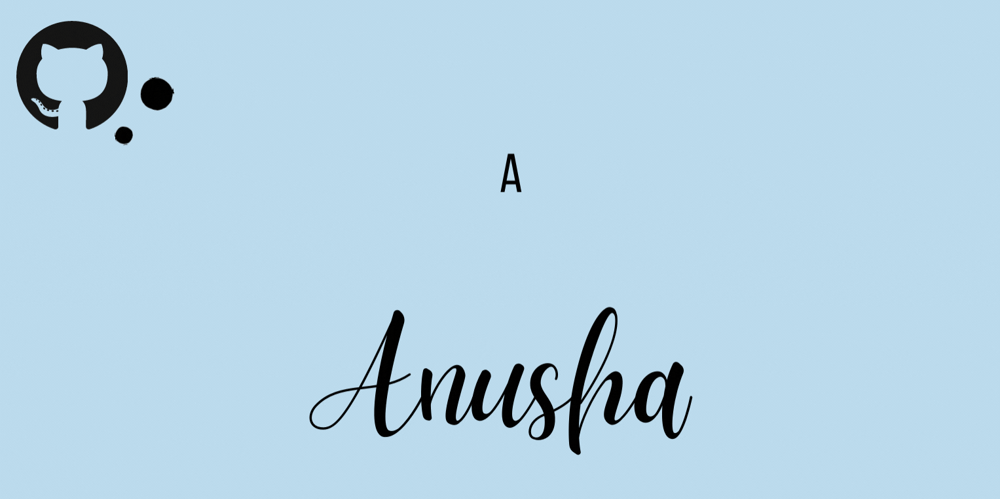

 

<h2>Hey  , I am Anusha !</h2>
<i> Here are some of my favourite projects 💻 (in no particular order) </i>

 
 

<a href="https://github.com/AnushaNathRoy/Dromos-Routinge"><code>Dromos</code> 🗺️</a>
 
 
A user-friendly routing application that determines the best route by analysing real-time traffic conditions and city data based on Dijkstra’s Algorithm.
 
Tech Stack:<code>C</code> | <code>C++</code>| <code>Dot</code>
 
Concepts: <code>Data Structures and Algorithms</code> | <code>Data Analysis</code> | <code>Map</code>

<a href="https://github.com/AnushaNathRoy/Youtube-Study-Buddy"><code>Youtube-Study-Buddy</code> ⏯️</a>
 
 
The app assists in finding the most relevant clickable time-stamps in video transcript for a given search query. This tool is also great for taking notes especially for annotations and research while watching YouTube videos.
 
Tech Stack:<code>Python</code> | <code>Flask</code>| <code>Jinja</code> | <code>Youtube API</code>
 
Concepts: <code>Web App Development</code> | <code>API</code>

<a href="https://github.com/varshitakolipaka/MoodBingo"><code>MoodBingo!</code> 🎮</a>
 
 
A heuristic based online multiplayer game. It puts a twist on the classic games of Bingo and Truth or Dare including features such as real-time messaging, breakout rooms and customised prompts.
 
Tech Stack:<code>Express</code> | <code>React.JS</code>| <code>Node.JS</code> | <code>Socket.IO</code>
 
Concepts: <code>Game Development</code> | <code>Client-Server Application</code> | <code>WebSocket</code>

<a href="https://github.com/AnushaNathRoy/Depression-and-Anxiety-Detection-on-Social-Media"><code>Early Depression Detection Model</code> 💬</a>
 
 
A machine learning model to predict symptoms of anxiety and depression through social media texts using concepts of NLP and sentiment analysis.
 
Tech Stack:<code>Scikit-Learn</code> | <code>Python</code>| <code>Jupyter</code>
 
Concepts: <code>Data Science</code> | <code>ML</code> | <code>Sentiment Analysis</code> | <code>NLP</code>

<a href="https://github.com/AnushaNathRoy/-SASH-"><code>SASH</code>  🐚💻</a>
 
<i> ~$> Welcome to your new and optimised shell sash! — </i>
 
 
A completely operational Bash like shell written in C using system calls, which supports built-in commands, directory management, piping, process handling (background and foreground) as well as input-output redirection.
 
Tech Stack:<code>C</code> | <code>C++</code>
 
Concepts: <code>Operating Systems</code> | <code>System Calls</code>

<a href="https://github.com/AnushaNathRoy/KlashOfKlans"><code>KlashOfKlans</code> 👑 </a>
 
 
A 2D terminal based game based on Clash of Clans written in Python implementing OOPS concepts. The objective of the game is to destroy as many buildings as possible, and collect the maximum amount of loot while doing so. There will be an army of troops to help the king clean up.
 
Tech Stack:<code>Python</code> 
 
Concepts: <code>OOPS</code> | <code>Game Dev</code>

<a href="https://github.com/AnushaNathRoy/Treasures-Of-Neverland"><code>Treasures Of Neverland</code> 🏴‍☠️ </a>
 
 
A 3D adventure game using Three.js and WebGL. Navigate the seas of Neverland escaping Captain Hook's goons and collecting the lost treasures on the sea! Happy Sailing :)
 
Tech Stack:<code>WebGL</code> | <code>Three.js</code>
 
Concepts: <code>Game Dev</code> | <code>Computer Graphics</code> |<code>3D Graphics</code>

<a href="https://github.com/AnushaNathRoy/Mine-Mania"><code>Mine-Mania</code> ⛏️️ </a>
 
 
A 2D top-down adventure game written in OpenGL set in the cold dark Mines of Moria. Collect your riches but beware of the enemies lurking in the dark miners!
 
Tech Stack:<code>OpenGL</code> | <code>C</code>
 
Concepts: <code>Game Dev</code> | <code>Computer Graphics</code> |<code>2D Graphics</code>

<a href="https://github.com/AnushaNathRoy/DBD"><code>DBD</code> 🎮️️ </a>
 
 
A database management CLI system for the well-renowned game Dead By Daylight.
 
Tech Stack:<code>Python</code> | <code>SQL</code>| <code>sqlite</code>
 
Concepts: <code>Database Management System</code>

